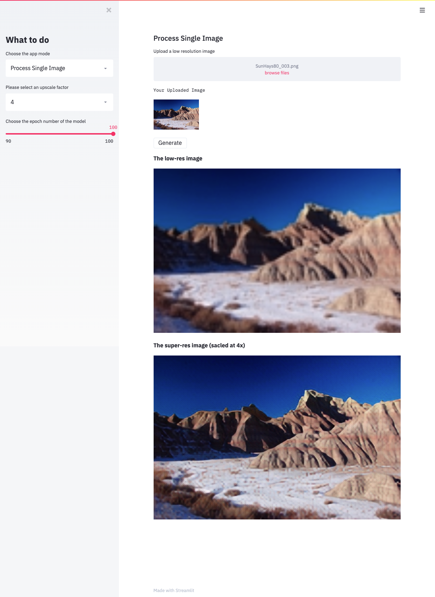

# Course Project - ENGI 9805 Computer Vision 
A web app for generating photo-realistic Super-Resolution Images/Videos based on [SRGAN](https://arxiv.org/abs/1609.04802).

Try the [demo](https://srgan.herokuapp.com/).

> Due to the hardware limitation of the server, the online version of the appliction can **only process images with size smaller than 240 x 240.**

> If you want to test on larger images, please download the app and run it on your local machine.




## Installation

Clone the repo

```
git clone git@github.com:ENGI9805-COMPUTER-VISION/Term-Project.git
```

cd into the project root folder
```
cd Term-Project
```

Create a conda virtual environment

```
conda create -n srgan_env python=3.6.8
```

and activate environment

```
conda activate srgan_env
```

Then you need to install the project dependencies

```
pip install -r requirements.txt
```

## Usage

Run the app
```
streamlit run app.py
```

### Available models

- [x] netG epoch 100 upscale factor 2
- [x] netG epoch 100 upscale factor 4
- [x] netG epoch 100 upscale factor 8

## Work Log

- [ ] **Build the program**
    - [x] Machine learning resource management
    - [x] Data ingestion and collection (Jason)
    - [x] Setup & configure cloud computing environment for GPU training (Jason)
    - [x] Model training (Jason, Luo)
    - [x] Integrating trained model with web app
    - [ ] Process Single Video (Ian)
    - [x] Add statistic terms definition
    - [ ] Fix png file alpha channel error
    - [x] Fix Show Benchmark Datasets error
    - [ ] Refactor code and add comments
- [x] **Deploy working demo on Heroku platform**
    - [x] Add startup file (Jason)
    - [x] Inject necessary dependencies (Jason)
    - [x] Fix deployment error (Jason)
    - [ ] Add Image size check
- [x] **Write project report**
    - [x] Choose a suitable template and fine-tune the layout & style (Jason)
    - [x] Abstract (Jason)
    - [x] Introduction (Jason)
    - [x] Problem definition (Luo)
    - [x] Proposed solution (Ian)
    - [x] Results and discussion (Jason & Luo)
    - [x] Conclusion (Ian)
    - [x] Reference (Jason)
- [ ] **Write presentation slides**
    - [x] Choose a suitable template and fine-tune the layout & style (Jason)
    - [x] Background & Motivation (Jason)
    - [x] Our Solution
    - [ ] Result
    - [x] Demo (Jason)
    - [ ] Conclusion & Futrue Work 
    - [x] References (Jason)
- [ ] **Record presentation video**
    - [ ] Slides part
    - [ ] Demo part
